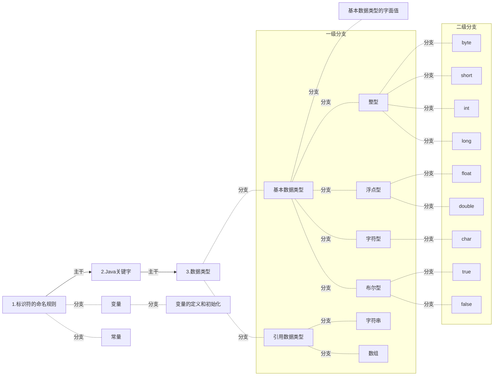

# Java 常量

<br>

### 关键字 final 用法之一：

<br>

> 修饰变量，对于基本数据类型的变量，其数值在初始化后不能被修改，如果是引用数据类型的变量，对其初始化之后不能再让其指向另一个对象。


<br>
<br>

```java
package Java数据类型;

public class FinalDemo {
    public static void main(String[] args){
        // intValue1 是一个变量
        int intValue1 = 10;

        //  INT_VALUE 是一个常量，常量命名全部大写,单词之间使用下划线连接
        final int INT_VALUE = 100;

        //  变量在其初始化之后可以任意修改
        intValue1 = 300;

        //  常量在其初始化之后无法修改
        //  INT_VALUE = 500; 会报错

        // 定义常量PI
        final double PI = 3.14159;

        // 定义常量MIN_VALUE
        final int MIN_VALUE = 0;
    }
}

```

<br>
<br>
<br>
<br>

# 总结

<br>

